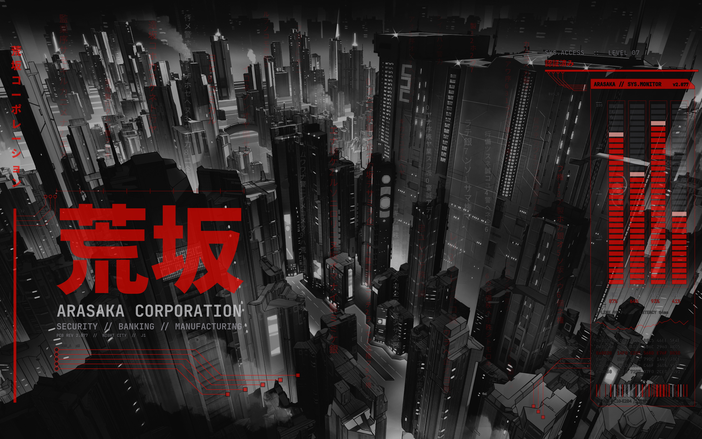

# Arasaka

An [Omarchy](https://omarchy.org) theme inspired by the Arasaka Corporation from Cyberpunk 2077: black steel, corporate red, and a touch of Japanese.



## Install

```
omarchy theme install https://github.com/MartinJeanne/omarchy-arasaka-theme
```

Optional boot splash, run once after installing:

```
omarchy-plymouth-set-by-theme arasaka
```

## What's inside

- `colors.toml`: the palette, source of truth for every generated app config.
- `hyprland.lua`: dark red window borders, blur, translucent windows and shell surfaces.
- `shell.*.toml`: crimson top bar, translucent launcher, menu, popups, notifications and lock screen.
- `backgrounds/`: two 3840x2400 wallpapers, the HUD watermark over a monochrome city and over plain black.
- `unlock.png`, `preview-unlock.png`: Plymouth logo and its preview.
- `watermark.py`: regenerates the HUD watermark (Noto Sans CJK JP and JetBrainsMono Nerd Font required).

## Regenerating the wallpapers

```
CJK=$(fc-match -f '%{file}' "Noto Sans CJK JP:style=Black")
CJKR=$(fc-match -f '%{file}' "Noto Sans CJK JP:style=Regular")
MONO=$(fc-match -f '%{file}' "JetBrainsMono Nerd Font:style=Bold")
BBOX=$(magick -size 3840x2400 xc:none -font "$CJK" -pointsize 520 -fill red \
  -draw "text 300,1560 '荒坂'" -trim -format '%X %Y %w %h' info: | tr -d '+')
python3 watermark.py "$CJK" "$CJKR" "$MONO" "$BBOX" > watermark.mvg
magick -size 3840x2400 xc:none -draw @watermark.mvg wm.png
```

Then composite `wm.png` over your base image with ImageMagick.
